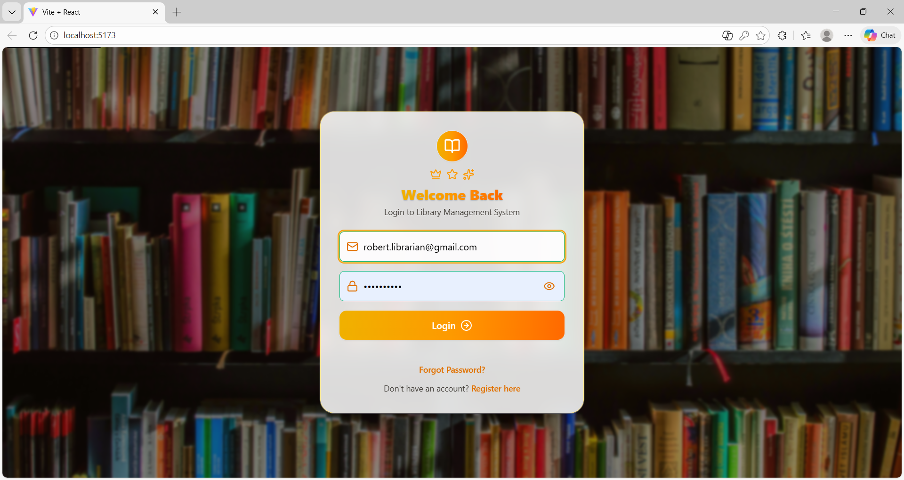

# 📚 Librario – Library Management System

## 📌 Overview
**Librario** is a full-stack Library Management System built using **Spring Boot** and **React**.  
The system enables efficient management of books, members, borrowing, returns, and fines with real-time inventory tracking. It also includes **role-based access**, **email notifications**, and an integrated **AI chatbot** for user assistance.

---

🌐 **Live Demo**  
🚀 _Deployment link will be added soon_

---

## 🎯 Features

### 👤 User Management
- 🔐 Role-based access (Admin, Librarian, Member)
- 📝 User registration and secure login (JWT)
- 🔑 Password reset with OTP/email

### 📚 Book Management
- ➕ Add / Update / Delete books
- 🔍 Search and filter by title, author, genre
- 📦 Real-time availability tracking

### 🔄 Circulation System
- 📖 Book issue and return
- 🔁 Renewal functionality
- 📌 Book reservation system

### 💰 Fine & Membership
- ⏱️ Automatic overdue fine calculation
- 💳 Fine and membership payment tracking
- 📊 Member borrowing history

### 🔔 Notifications
- 📧 Email alerts for:
  - Due date reminders
  - Overdue notifications
  - Membership updates

### 🤖 AI Chatbot
- 💬 Instant user assistance
- 📚 Helps with book and system queries

---

## 🖥️ Tech Stack

- 🌐 **Frontend:** React (Vite)
- ⚙️ **Backend:** Spring Boot, Spring Security
- 🗄️ **Database:** MySQL
- 🔐 **Authentication:** JWT
- 📧 **Email Service:** Spring Mail
- 🤖 **AI Integration:** Gemini API
- 🛠️ **Tools:** Git, GitHub, IntelliJ IDEA, VS Code

---

## 🖼️ Screenshots

📌 **Login Page**  

📌 **Admin Dashboard**  

📌 **Book Management**  

📌 **Member Dashboard**  

📌 **Chatbot**  

---

## 🚀 Future Plans

- 🌐 Cloud deployment  
- 📱 Mobile responsive improvements  
- 📊 Advanced analytics dashboard  
- 💳 Online payment gateway integration  

💡 *Stay tuned for updates!* 🎉

---

## 📬 Contact & Feedback

📧 [devisarunadevidd@gmail.com](mailto:devisarunadevidd@gmail.com)  
🔗 [GitHub Profile](https://github.com/devisarunadevid)

---

✨ *Made with ❤️ by **Devis Aruna Devi***
